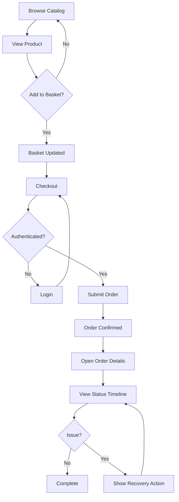
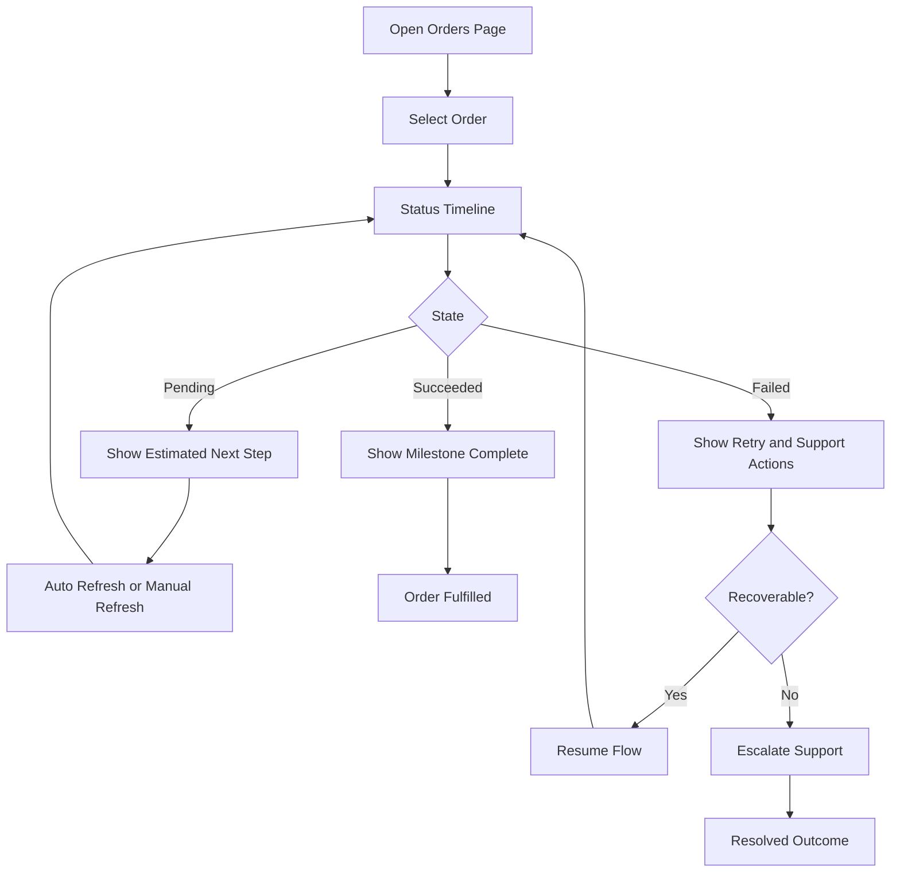

---
stepsCompleted:
  - 1
  - 2
  - 3
  - 4
  - 5
  - 6
  - 7
  - 8
  - 9
  - 10
  - 11
  - 12
  - 13
  - 14
lastStep: 14
inputDocuments:
  - _bmad-output/planning-artifacts/prd.md
  - README.md
  - docs/LOCAL_SETUP.md
  - docs/adr/ADR-001.md
  - docs/adr/ADR-002.md
  - docs/adr/ADR-003.md
  - docs/adr/ADR-004.md
  - IMPROVEMENTS.md
workflowType: 'ux-design'
project_name: 'eShop'
user_name: 'Harry'
date: '2026-04-02'
---

# UX Design Specification eShop

**Author:** Harry
**Date:** April 2, 2026

---

<!-- UX design content will be appended sequentially through collaborative workflow steps -->

## Executive Summary

### Project Vision

eShop is a production-representative .NET e-commerce reference application that helps teams ship distributed commerce systems faster by providing a coherent, runnable, and tested baseline. From a UX perspective, the product must balance two audiences: real shoppers completing commerce journeys and developers learning and extending the platform with confidence.

### Target Users

1. Developers and architects adopting microservices and .NET Aspire patterns.
2. Shoppers using the storefront for browse, basket, checkout, and order tracking.
3. Operators validating health, startup correctness, and runtime reliability.
4. Extenders adding new capabilities while preserving established conventions.

### Key Design Challenges

1. Keeping shopper flows simple while backend behavior is asynchronous and distributed.
2. Making order status progression understandable despite eventual consistency.
3. Maintaining UX consistency across web surfaces and shared components.
4. Supporting developer discoverability without exposing internal complexity in the shopper journey.

### Design Opportunities

1. Turn checkout and post-checkout status into a high-trust experience with clear state communication.
2. Make order tracking a signature UX feature through timeline clarity and recoverable edge states.
3. Improve first-run developer UX with strong in-product cues tied to docs and diagnostics.
4. Establish reusable UX patterns that map cleanly to service boundaries and testing layers.

## Core User Experience

### Defining Experience

The core experience is a confidence-first commerce loop:

1. discover relevant products quickly,
2. build and persist a basket without friction,
3. complete authenticated checkout with clear progress,
4. track order lifecycle with understandable status transitions.

For shoppers, the critical interaction is the path from basket to confirmed order. For developer users, the critical interaction is finding and extending these flows without guesswork. The UX should make both journeys feel deliberate and predictable.

### Platform Strategy

Primary platform is web via Blazor WebApp, with shared component reuse for HybridApp scenarios. Interaction model is predominantly mouse/keyboard on desktop and laptop, with responsive behavior for tablet/mobile viewport usage. Offline mode is not a core requirement; instead, resilience should focus on recoverable online interactions, safe retries, and explicit status messaging when asynchronous processing is in flight.

Platform constraints to honor:

1. asynchronous backend progression (event-driven workers),
2. mixed transport architecture behind the UI (REST plus gRPC),
3. authentication-gated checkout and order history,
4. operational health and startup validity expectations.

### Effortless Interactions

These interactions should feel nearly automatic:

1. adding/removing basket items with immediate feedback and persisted state,
2. returning users seeing their basket and order context restored predictably,
3. checkout form progression with minimal cognitive load and clear validation,
4. order detail/status reading without requiring users to interpret system internals.

Step eliminations and automation opportunities:

1. prefill and reuse known customer data where appropriate,
2. keep status language user-centered rather than infrastructure-centered,
3. surface next best action on failed or delayed transitions,
4. avoid forcing manual refresh patterns where a lightweight status sync can improve clarity.

### Critical Success Moments

Make-or-break moments in the experience:

1. first successful add-to-basket and basket persistence after navigation/session change,
2. checkout submission and confirmation response clarity,
3. first view of post-checkout order status where users must understand what happens next,
4. error handling moments (auth expiry, invalid inputs, transient backend delays) where trust can be preserved or lost.

The this is better moment is when users can move from intent to confirmation with no ambiguity about what succeeded, what is pending, and what they should do next.

### Experience Principles

1. State clarity over system cleverness: always show users what state they are in and what comes next.
2. Frictionless continuity: preserve user progress across navigation, auth transitions, and async delays.
3. Boundary-safe consistency: UI patterns should remain consistent even when backed by different services/transports.
4. Confidence at every handoff: confirmations, failures, and pending states must all be explicit and actionable.
5. Extendable by design: UX patterns should be predictable enough for contributors to add features without fragmenting interaction quality.

## Desired Emotional Response

### Primary Emotional Goals

1. Confidence: users should feel they always understand what the system is doing.
2. Trust: users should believe checkout and order handling are reliable and safe.
3. Control: users should feel they can recover from errors and continue without losing progress.
4. Competence: developer users should feel empowered to understand and extend the system quickly.

### Emotional Journey Mapping

1. First discovery: users should feel oriented, not overwhelmed.
2. Core shopping flow: users should feel momentum and clarity, not hesitation.
3. Checkout completion: users should feel certainty that the order is accepted and progressing.
4. Post-checkout tracking: users should feel informed and reassured during async state changes.
5. Returning usage: users should feel continuity, with context and progress preserved.

### Micro-Emotions

1. Confidence over confusion during status updates and validation feedback.
2. Reassurance over anxiety when async processing introduces delay.
3. Accomplishment over doubt at order confirmation and milestone transitions.
4. Calm over frustration when auth/session interruptions occur.
5. Delight through small clarity wins: meaningful labels, explicit next actions, and predictable outcomes.

### Design Implications

1. Confidence -> use explicit state labels, visible progression markers, and unambiguous confirmations.
2. Trust -> prioritize consistency in copy, validation behavior, and error handling across pages.
3. Control -> provide recovery paths (retry, resume, re-auth) without discarding user work.
4. Reassurance -> explain pending states in plain language rather than technical terms.
5. Competence (developer audience) -> keep UX patterns predictable and documented for extension.

### Emotional Design Principles

1. Explain every transition: no silent state changes in critical flows.
2. Preserve user progress by default across navigation and session boundaries.
3. Make system latency emotionally safe with clear pending and completion cues.
4. Prefer plain-language confidence signals over clever but ambiguous interactions.
5. Design for graceful failure so users leave with trust intact, even when operations fail.

## UX Pattern Analysis & Inspiration

### Inspiring Products Analysis

1. Amazon:

- Strength: fast product discovery, strong filter/sort patterns, high-confidence checkout progression.
- Lesson: reduce decision friction with predictable list/detail/cart flow and clear fulfillment expectations.

2. Shopify storefront patterns:

- Strength: clean product pages, trust signals, straightforward cart-to-checkout transitions.
- Lesson: keep content hierarchy simple and conversion-focused while preserving transparency around shipping and order status.

3. Stripe Dashboard (developer-facing inspiration):

- Strength: clear information architecture, explicit state communication, actionable error guidance.
- Lesson: for eShop's developer/operator audience, present technical states with clarity and next-step guidance instead of opaque failures.

### Transferable UX Patterns

1. Navigation patterns:

- Sticky global cart/account access across browsing and detail pages.
- Progressive disclosure in checkout so users focus on one decision at a time.

2. Interaction patterns:

- Inline validation with recovery guidance instead of end-of-form error dumps.
- Explicit async status states (pending, confirmed, failed, retrying) with plain-language explanations.

3. Visual patterns:

- Persistent trust cues in checkout and order tracking (state chips, timeline markers, confirmation blocks).
- Clear separation between user-facing language and technical diagnostic language.

### Anti-Patterns to Avoid

1. Hidden async behavior:

- Avoid silent background transitions where users do not know whether action succeeded.

2. Overloaded checkout pages:

- Avoid dense forms and mixed priorities that create abandonment risk.

3. Ambiguous order states:

- Avoid status labels that reflect internal events but do not explain customer impact.

4. Inconsistent error semantics:

- Avoid different copy and recovery actions for equivalent failures across pages/services.

### Design Inspiration Strategy

1. What to adopt:

- High-clarity cart and checkout progression patterns from mature commerce products.
- Explicit state and error communication patterns from strong developer tooling UX.

2. What to adapt:

- Status timeline patterns adapted to event-driven order progression in eShop.
- Trust messaging adapted for both shopper confidence and developer observability needs.

3. What to avoid:

- Magic interactions with unclear outcomes.
- Heavy visual complexity that reduces first-time comprehension.

4. eShop-specific direction:

- Build a confidence-first UX where every transition is understandable, recoverable, and consistent with the underlying distributed architecture.

## Design System Foundation

### 1.1 Design System Choice

Chosen approach: Themeable system built on existing Blazor component patterns and tokens.

Practical interpretation for eShop:

1. Keep the current Blazor-first foundation as the base system.
2. Establish a reusable token layer for color, spacing, typography, elevation, and status semantics.
3. Build a thin, opinionated component library in shared UI surfaces so web and hybrid experiences stay aligned.
4. Avoid introducing a large external visual framework that conflicts with the existing architecture and contributor patterns.

### Rationale for Selection

1. Balance of speed and uniqueness:

- Faster than a fully custom system from scratch.
- More flexible and brandable than a rigid off-the-shelf design language.

2. Alignment with current architecture:

- Fits the existing WebApp and shared component approach.
- Supports predictable extension by contributors already working in this codebase.

3. Lower migration and maintenance risk:

- Preserves current implementation velocity.
- Avoids heavy dependency lock-in and major UI rewrites.

4. Better support for confidence-first UX goals:

- Lets us encode state clarity, error semantics, and trust cues as reusable primitives across flows.

### Implementation Approach

1. Define core design tokens:

- semantic color set (success, warning, error, info, pending),
- spacing scale,
- type scale,
- border radius and elevation scale,
- motion timing and easing.

2. Create foundational components:

- buttons, inputs, selects, validation messages,
- status chip/badge,
- step/progress indicators,
- timeline primitives for order progression,
- notification and alert primitives.

3. Codify flow-level patterns:

- cart actions and confirmations,
- checkout step containers,
- async pending and retry states,
- order-status timeline presentation.

4. Enforce consistency:

- shared patterns in component library,
- style and copy guidelines tied to state semantics,
- test coverage for component behavior and accessibility basics.

### Customization Strategy

1. Visual customization:

- support theme variables for adopter branding without changing component contracts.
- maintain default reference theme optimized for readability and trust.

2. Experience customization:

- allow configurable copy and labels for statuses and actions while preserving semantic meaning.
- keep interaction patterns stable even when visual styling changes.

3. Extension model:

- new feature teams add components by composing primitives first.
- custom one-off components require documented rationale when primitives do not fit.

4. Guardrails:

- no direct style drift in feature pages when a token/component alternative exists.
- no alternate status language that conflicts with global state semantics.

## 2. Core User Experience

### 2.1 Defining Experience

The defining experience for eShop is the confidence-first purchase progression:

1. discover an item,
2. commit intent via basket,
3. complete checkout with zero ambiguity,
4. understand post-checkout status immediately.

If this interaction is nailed, both shopper trust and developer confidence follow. The interaction users should describe is: I always know what happened to my order and what happens next.

### 2.2 User Mental Model

Users approach e-commerce with a straightforward mental model:

1. add item means saved for purchase,
2. checkout submit means order accepted,
3. order status means real progress toward delivery, not internal system noise.

Likely confusion points:

1. asynchronous state delays after checkout,
2. auth/session interruptions during checkout,
3. unclear distinctions between pending vs failed states.

Expected behavior:

1. state should be explicit,
2. progress should be visible,
3. recovery should be simple and non-destructive.

### 2.3 Success Criteria

The core experience is successful when:

1. users can complete add-to-basket and checkout without uncertainty,
2. every critical action yields immediate, understandable feedback,
3. order status progression is interpretable in plain language,
4. temporary failures preserve context and show clear recovery actions,
5. first-time users complete the primary flow without external help.

User success signals:

1. low hesitation at checkout transitions,
2. reduced repeat actions caused by uncertainty,
3. high confidence in post-checkout tracking.

### 2.4 Novel UX Patterns

Primary approach: established patterns with focused innovation.

Established patterns to keep:

1. familiar browse -> detail -> basket -> checkout flow,
2. progressive disclosure in multi-step checkout,
3. standard inline validation and confirmation cues.

Innovative adaptations for eShop:

1. confidence-oriented async status model that translates event-driven backend states into user-centered timeline states,
2. dual-audience clarity where shopper-facing states remain simple while developer/operator diagnostics remain discoverable but separate.

### 2.5 Experience Mechanics

1. Initiation:

- users begin from product list or detail with persistent cart visibility and explicit action affordances.

2. Interaction:

- users add/remove/update basket items with immediate visual confirmation and preserved state.
- checkout proceeds as guided steps with explicit requirements and validation.

3. Feedback:

- each action returns clear success/pending/failure semantics.
- async transitions surface status updates with plain-language explanations and expected next state.

4. Completion:

- order submission ends with a definitive confirmation state.
- order details page provides timeline visibility, current status meaning, and next expected milestone.
- when issues occur, users get a direct recovery path (retry, resume, re-auth) without losing progress.

## Visual Design Foundation

### Color System

Brand baseline: no strict external brand guide is assumed, so the system uses a confidence-first neutral palette with purposeful semantic accents.

1. Core palette strategy:

- neutral-first surfaces for readability and low cognitive load,
- restrained primary accent for action affordances,
- strong semantic states for success/warning/error/pending.

2. Semantic mapping:

- Primary: key calls to action and selected states.
- Secondary: supportive UI actions and less critical emphasis.
- Success: confirmed actions and completed milestones.
- Warning: needs attention but not blocked.
- Error: failed actions requiring user correction.
- Info/Pending: in-progress async transitions and explanatory notices.

3. Emotional alignment:

- confidence and trust via stable neutral backgrounds and high-contrast text,
- control via consistent status colors used identically across basket, checkout, and tracking,
- reassurance via clear pending and success distinctions during async order processing.

4. Accessibility targets:

- color pairings meet WCAG 2.1 AA contrast for text and controls,
- no status communicated by color alone; all semantic states include label/icon reinforcement.

### Typography System

1. Tone and hierarchy:

- modern, clear, and pragmatic typography supporting both shopper and developer readability.
- hierarchy optimized for scanability in commerce lists and detail-heavy order states.

2. Type roles:

- Display/Heading: concise, high-contrast section anchors.
- Body: readable default for product and status context.
- UI text: compact, explicit labels for actions and state cues.
- Mono/supporting technical text: selective use for developer/operator-facing diagnostics.

3. Scale and rhythm:

- consistent modular scale for headings and body sizes,
- generous line height for long-form details and status descriptions,
- predictable spacing between heading/body blocks to preserve flow.

4. Accessibility:

- support user zoom and responsive scaling without layout breakage,
- maintain minimum comfortable body sizes for mixed desktop/tablet use.

### Spacing & Layout Foundation

1. Spacing model:

- base 8-point spacing scale for component and page rhythm.
- tighter spacing in dense transactional views, wider spacing in confirmation and tracking contexts.

2. Layout principles:

- prioritize clear progression over visual novelty in core flows.
- preserve stable placement for critical actions (cart, checkout next step, retry/resume actions).
- use whitespace to separate decision zones: browsing, payment confirmation, tracking status.

3. Grid and structure:

- responsive layout with clear content regions (navigation, primary task pane, supporting context).
- checkout and status views use step-oriented containers with explicit progression framing.

4. Component spacing relationships:

- uniform internal spacing for form fields, validation messages, and action groups.
- status elements (chips, timeline nodes, alerts) use consistent padding and alignment across pages.

### Accessibility Considerations

1. Contrast and readability:

- enforce WCAG AA contrast across all core text and controls.
- validate semantic-state legibility in light and dark-adjacent neutral surfaces if theme variants are introduced.

2. Interaction accessibility:

- keyboard-first navigation support for browse, basket, checkout, and tracking.
- visible focus indicators for all interactive elements.
- clear error messaging tied to fields and summarized for fast recovery.

3. Cognitive accessibility:

- plain-language state labels for async progression.
- avoid ambiguous or overloaded terminology in critical transitions.
- preserve consistent action naming and button placement through all flow steps.

4. Motion and feedback accessibility:

- subtle motion only where it clarifies state change.
- support reduced-motion preferences for users sensitive to animation.

## Design Direction Decision

### Design Directions Explored

Eight directions were explored in the visualizer, covering:

1. dense transactional clarity,
2. calm low-stress commerce,
3. guided step-first checkout,
4. warm retail conversion emphasis,
5. operator-friendly status precision,
6. monochrome minimal clarity,
7. milestone/progress-centric tracking,
8. expressive CTA-forward direction.

All options maintain the confidence-first UX principles, async state clarity, and reusable token/component strategy.

### Chosen Direction

Proposed choice: Direction 5 (Operator Clear) with selective traits from Direction 2 (Calm Commerce).

Why this blend:

1. Direction 5 best supports dual audiences (shopper clarity + developer/operator trust).
2. Direction 2 adds emotional calm and lower cognitive load for checkout.
3. The combined style aligns strongly with eShop's confidence-first, state-explicit model.

### Design Rationale

1. It preserves clear order-state semantics, critical for event-driven lifecycle transparency.
2. It reduces ambiguity in high-risk flows (checkout, pending transitions, failure recovery).
3. It scales well across WebApp and shared component usage without heavy rework.
4. It supports documentation and extension patterns expected in a reference application.

### Implementation Approach

1. Use Direction 5 information architecture as the baseline for cart, checkout, and order-tracking pages.
2. Apply Direction 2 spacing rhythm and softer surface treatment to reduce stress in transactional screens.
3. Keep semantic status chips/timelines consistent across all major flows.
4. Encode these patterns into shared tokens and foundational components first, then flow-level compositions.

## User Journey Flows

### Shopper Purchase and Tracking Flow

This flow operationalizes the primary shopper journey from discovery to post-checkout confidence, including auth and recovery handling.

### Order Status Recovery Flow

This flow details how users interpret asynchronous order states and recover when progression fails or stalls.

### Journey Patterns

1. Entry points are always explicit and task-oriented.
2. Every critical step has state feedback, not silent transitions.
3. Authentication interruptions return users to in-progress work.
4. Async lifecycle states always include what now guidance.
5. Recovery paths are visible and non-destructive.

### Flow Optimization Principles

1. Minimize steps-to-value in browse-to-checkout progression.
2. Keep decision points single-purpose to reduce cognitive load.
3. Use plain-language status labels tied to user impact.
4. Prefer continuity and resume over restart in all error cases.
5. Surface certainty cues at all commitment boundaries.

## Component Strategy

### Design System Components

From the chosen themeable Blazor-first foundation, standard components should cover:

1. buttons, links, and icon actions,
2. form controls (input, select, checkbox, radio),
3. validation/error text blocks,
4. cards, lists, tables, and layout containers,
5. modal, drawer, tooltip, and notification primitives,
6. baseline badges/chips and progress indicators.

These should be used by default before introducing new custom components.

### Custom Components

1. Order Status Timeline

- Purpose: translate backend async states into user-centered progress.
- States: pending, completed, delayed, failed, recovered.
- Accessibility: labeled milestones, keyboard-readable sequence, aria-live for status changes.
- Usage: order details and order history status surfaces.

2. Checkout Step Rail

- Purpose: make multi-step checkout progression explicit and low-stress.
- States: not started, current, complete, blocked, error.
- Accessibility: step labels, current-step semantics, clear error targeting.

3. Recovery Action Panel

- Purpose: present clear next actions when failure or auth interruption occurs.
- Actions: retry, resume, re-authenticate, contact support.
- Accessibility: action-first layout, concise guidance copy, focus management.

4. Confidence Confirmation Block

- Purpose: provide definitive completion messaging after key commitments.
- Content: outcome summary, reference id, next milestone, expected timing.
- Variants: order confirmation, payment success, state-transition confirmation.

5. Async State Chip Set

- Purpose: normalize status vocabulary across cart/checkout/orders.
- States: pending, processing, confirmed, needs action, failed.
- Rule: no page-specific alternate status labels that conflict with global semantics.

### Component Implementation Strategy

1. Foundation-first:

- compose custom components from existing primitives and token system.
- avoid bespoke style implementations when tokenized variants can satisfy needs.

2. Consistency-first:

- centralize semantic state mappings in shared UI utilities/components.
- enforce one canonical status vocabulary across all shopper-facing flows.

3. Accessibility-first:

- keyboard operability for all custom components.
- visible focus indicators and screen-reader friendly state descriptions.
- avoid color-only communication for any critical state.

4. Contract-first:

- define explicit props/events for each custom component.
- include state and error behavior in component-level tests.

### Implementation Roadmap

Phase 1 (critical path):

1. Checkout Step Rail
2. Confidence Confirmation Block
3. Async State Chip Set

Phase 2 (post-checkout clarity):

1. Order Status Timeline
2. Recovery Action Panel

Phase 3 (quality hardening):

1. accessibility audits on custom components
2. visual regression snapshots for core states
3. UX copy normalization for state and recovery messaging

## UX Consistency Patterns

### Button Hierarchy

1. Primary buttons:

- one per decision zone, used for the main forward action.
- consistent placement and label style in checkout and recovery flows.

2. Secondary buttons:

- supporting actions (back, edit, view details), visually lower emphasis.

3. Tertiary/text actions:

- low-risk utility interactions (dismiss, learn more, expand details).

4. Destructive actions:

- visually distinct, require confirmation when data/state loss is possible.

### Feedback Patterns

1. Success:

- immediate confirmation with clear result and optional next step.
- use confirmation block pattern at commitment boundaries.

2. Warning:

- highlight potential issues without blocking task continuation.

3. Error:

- plain-language cause + precise recovery action (retry/resume/re-auth).
- never leave users at dead ends.

4. Info/Pending:

- explicit pending semantics for async operations with expected next milestone.

### Form Patterns

1. Validation:

- inline validation near fields plus summarized errors for quick recovery.
- validate progressively, not only at final submit.

2. Field behavior:

- labels persist (no placeholder-only critical labels),
- helpful defaults/prefill where safe.

3. Submission:

- disable duplicate commits while showing in-progress state.
- preserve entered data on recoverable failure.

4. Accessibility:

- programmatic label association, error-to-field linking, keyboard-first flow.

### Navigation Patterns

1. Global navigation:

- stable cart/account entry points from all commerce pages.

2. Journey navigation:

- checkout step rail reflects current state and completed milestones.

3. Back/return behavior:

- returning from auth or details preserves context and progress.

4. Deep-link support:

- order details/status pages are directly reachable with coherent state presentation.

### Additional Patterns

1. Modal and overlay patterns:

- use for focused confirmations and short critical tasks only.
- avoid multi-step workflows inside modals.

2. Empty states:

- always include action-oriented guidance (what to do next).

3. Loading states:

- skeletons/spinners paired with short semantic messaging.
- transitions should reduce uncertainty, not just indicate waiting.

4. Search and filtering:

- immediate feedback on filter changes,
- clear active-filter visibility and easy reset controls.

5. Mobile considerations:

- thumb-friendly action targets,
- stacked decision zones,
- persistent access to core actions (cart/checkout/status).

## Responsive Design & Accessibility

### Responsive Strategy

1. Desktop:

- use multi-region layouts for catalog density, checkout context, and order-status visibility.
- surface supplementary diagnostics/support context without crowding primary shopper actions.

2. Tablet:

- preserve flow clarity with simplified two-region layouts.
- increase touch affordance spacing while keeping progress visibility (step rail and status cues).

3. Mobile:

- prioritize single-column task flow and high-clarity action hierarchy.
- keep critical actions persistently accessible (cart, continue, retry/resume).
- reduce peripheral content until user requests expansion.

4. Interaction strategy:

- keep behavior consistent across form factors, changing layout before changing interaction semantics.
- maintain confidence cues and recovery patterns identically across devices.

### Breakpoint Strategy

1. Breakpoint baseline:

- Mobile: 320px-767px
- Tablet: 768px-1023px
- Desktop: 1024px+

2. Approach:

- mobile-first implementation with progressive enhancement for tablet/desktop.
- responsive components that adapt spacing, hierarchy, and density by breakpoint.

3. Key adaptation rules:

- collapse multi-panel desktop views into sequenced sections on mobile.
- retain timeline/status semantics at all breakpoints.
- preserve consistent button hierarchy and placement logic, even when stacked.

### Accessibility Strategy

1. Target level:

- WCAG 2.1 AA baseline across core user journeys.

2. Core requirements:

- contrast-compliant text and controls.
- full keyboard operability for browse, basket, checkout, and tracking.
- screen-reader-friendly labels, states, and status updates.
- non-color status reinforcement through text/icon cues.
- minimum touch target sizing for mobile interactions.

3. High-risk accessibility zones:

- checkout validation and error recovery,
- async order-status updates,
- auth interruptions and resume flows,
- timeline semantics for state progression.

### Testing Strategy

1. Responsive testing:

- validate on representative mobile/tablet/desktop viewports.
- cross-browser checks on Chromium, Firefox, and WebKit.
- verify layout integrity under zoom and text scaling.

2. Accessibility testing:

- automated checks integrated in CI where feasible.
- keyboard-only navigation walkthroughs for all critical flows.
- screen-reader pass on key pages (catalog, checkout, order details).
- contrast and focus-visibility audits for all state variants.

3. Scenario testing:

- auth interruption and resume,
- failed transition recovery actions,
- low-vision and high-zoom usage on checkout and tracking.

### Implementation Guidelines

1. Responsive development:

- use relative units and tokenized spacing scales.
- keep mobile-first media queries and component-level responsiveness.
- avoid breakpoint-specific behavior divergence unless required by device constraints.

2. Accessibility development:

- semantic markup first, ARIA only where needed.
- explicit focus management on modals/errors/recovery panels.
- consistent announcement strategy for async state changes.

3. Quality gates:

- no new core-flow UI without keyboard and screen-reader acceptance checks.
- no status component shipped without non-color semantics and contrast verification.
- no form flow shipped without inline + summary validation support.
