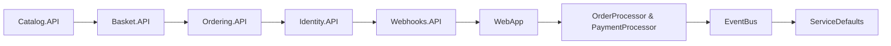

# Architecture: local/eShop

## Overview

eShop uses a microservices architecture orchestrated by .NET Aspire. Each service is independently deployable with its own database. Services communicate via RabbitMQ event bus for async operations and gRPC for sync calls. The Aspire AppHost manages service discovery, configuration, and observability. Frontend uses Blazor for web and .NET MAUI for mobile clients.

<details>
<summary>Sources</summary>

- `src/eShop.AppHost/Program.cs`
- `src/Catalog.API/Program.cs`
- `src/Catalog.API/Apis/CatalogApi.cs`
- `README.md`

</details>


## System Diagram



## Components

### Catalog.API

**Directory:** `src/Catalog.API`

Manages product catalog with PostgreSQL + pgvector for AI-enhanced search. Publishes integration events for catalog changes.

### Basket.API

**Directory:** `src/Basket.API`

Shopping basket service using Redis for fast storage. Exposes gRPC endpoints and subscribes to order events.

### Ordering.API

**Directory:** `src/Ordering.API`

Order processing with DDD patterns (domain models, aggregates). Uses PostgreSQL and publishes order lifecycle events.

### Identity.API

**Directory:** `src/Identity.API`

Authentication/authorization using Duende IdentityServer with JWT tokens.

### Webhooks.API

**Directory:** `src/Webhooks.API`

Manages webhook subscriptions and delivery for external integrations.

### WebApp

**Directory:** `src/WebApp`

Blazor Server web UI consuming backend APIs with service discovery.

### OrderProcessor & PaymentProcessor

**Directory:** `src/OrderProcessor, src/PaymentProcessor`

Background workers processing orders and payments via event bus.

### EventBus

**Directory:** `src/EventBus, src/EventBusRabbitMQ`

Abstraction layer for pub/sub messaging with RabbitMQ implementation.

### ServiceDefaults

**Directory:** `src/eShop.ServiceDefaults`

Shared extensions for observability, health checks, resilience, and service discovery.

## Code Examples

### Minimal API endpoint with versioning

**File:** `src/Catalog.API/Apis/CatalogApi.cs`

```csharp
var vApi = app.NewVersionedApi("Catalog");
var v1 = vApi.MapGroup("api/catalog").HasApiVersion(1, 0);
v1.MapGet("/items", GetAllItemsV1)
    .WithName("ListItems")
    .WithSummary("List catalog items")
    .WithTags("Items");
```

Shows how eShop uses minimal APIs with explicit versioning, descriptive metadata, and route grouping for clean API design.

### Service defaults registration

**File:** `src/Catalog.API/Program.cs`

```csharp
var builder = WebApplication.CreateBuilder(args);
builder.AddServiceDefaults();
builder.AddApplicationServices();
builder.Services.AddProblemDetails();
var withApiVersioning = builder.Services.AddApiVersioning();
builder.AddDefaultOpenApi(withApiVersioning);
```

Every service follows this pattern: AddServiceDefaults() configures observability, health checks, and resilience; AddApplicationServices() registers service-specific dependencies.

### Aspire service orchestration

**File:** `src/eShop.AppHost/Program.cs`

```csharp
var redis = builder.AddRedis("redis");
var rabbitMq = builder.AddRabbitMQ("eventbus").WithLifetime(ContainerLifetime.Persistent);
var postgres = builder.AddPostgres("postgres").WithImage("ankane/pgvector");
var catalogDb = postgres.AddDatabase("catalogdb");
var catalogApi = builder.AddProject<Projects.Catalog_API>("catalog-api")
    .WithReference(rabbitMq).WaitFor(rabbitMq)
    .WithReference(catalogDb);
```

Aspire AppHost declaratively configures infrastructure (Redis, RabbitMQ, Postgres) and services with dependencies, ensuring proper startup order.

### Publishing integration event

**File:** `Event Bus Pattern`

```Event Bus Pattern
public class OrderStartedIntegrationEvent : IntegrationEvent
{
    public string UserId { get; init; }
    public string UserName { get; init; }
}

await _eventBus.PublishAsync(new OrderStartedIntegrationEvent 
{ 
    UserId = order.BuyerId, 
    UserName = order.BuyerName 
});
```

Integration events inherit from IntegrationEvent base class and are published via IEventBus. Subscribers in other services react to these events asynchronously.

## Data Flow

User interacts with WebApp (Blazor) → WebApp calls backend APIs via HTTP → APIs use service discovery to locate each other → Async operations publish events to RabbitMQ → Background workers/services subscribe and react → Each service maintains its own database (Catalog, Order, Identity in PostgreSQL; Basket in Redis) → All telemetry flows to Aspire dashboard via OpenTelemetry

## Key Abstractions

- **IEventBus**: Abstraction for publishing and subscribing to integration events across microservices. Implemented by RabbitMQ.
- **IntegrationEvent**: Base class for events that cross service boundaries. Includes correlation and timestamp metadata.
- **ServiceDefaults extensions**: Extension methods (AddServiceDefaults, MapDefaultEndpoints) that configure health checks, telemetry, resilience, and service discovery for all services.
- **Minimal API with versioning**: Endpoints defined via MapGroup with explicit API versions (v1, v2) for backward compatibility.
- **Aspire ResourceBuilder**: Fluent API in AppHost for configuring services, databases, message brokers, and their dependencies.

## Entrypoints

| Path | Type | Description |
|------|------|-------------|
| `src/eShop.AppHost/Program.cs` | main | Aspire app host that orchestrates all microservices, databases, and message brokers |
| `src/Catalog.API/Program.cs` | server | Catalog API service entry point |
| `src/Basket.API/Program.cs` | server | Basket API service entry point |
| `src/WebApp/Program.cs` | server | Blazor web application entry point |

## Where to Change What

| Task | Location |
|------|----------|
| Add a new feature | `src/` |
| Add tests | `tests/Basket.UnitTests/` |
| Modify build | `package.json` |
| Update CI | `.github/workflows/pr-validation.yml` |

---
*Generated by [Repo Bootcamp](https://github.com/repo-bootcamp)*
