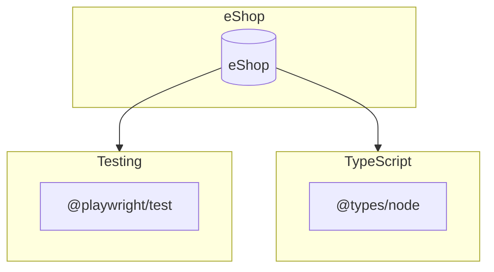

# Dependency Overview

This document provides an overview of the 3 dependencies used in eShop.

## Summary

| Type | Count |
|------|-------|
| Runtime | 0 |
| Development | 3 |
| **Total** | **3** |

## Dependency Graph

## By Category

### Testing

- `@playwright/test`

### TypeScript

- `@types/node`

## Runtime Dependencies

No runtime dependencies found.

## Development Dependencies

| Package | Version |
|---------|---------|
| @playwright/test | ^1.42.1 |
| @types/node | ^20.11.25 |
| dotenv | ^16.4.5 |
